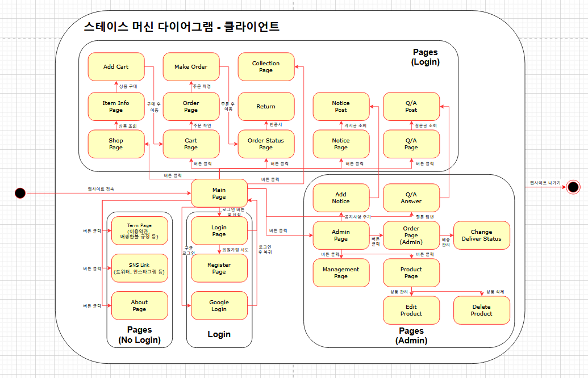

# SE-BlankSpace 
웹 쇼핑몰 프로젝트  
FE : https://github.com/Chyejeong/BlankSpace-Shopping-mall-fe 
BE : https://github.com/Chyejeong/BlankSpace-Shopping-mall-be 

## 1. 프로젝트 소개

이 프로젝트는 3학년 2학기에 수강한 '소프트웨어공학'의 팀프로젝트입니다.
웹 프로그래밍과 소프트웨어 설계 원리를 실제 프로젝트에 적용해보는 것을 목표로 하였으며, 기획부터 개발, 구현까지의 전 과정을 경험하며 팀원들과 협업을 통해 완성도를 높였습니다.

## 2. 프로젝트 개요 및 주요 기능

쇼핑몰의 핵심 기능은 다음과 같습니다:

- **상품 목록 조회 및 검색**
- **상품 상세 페이지**
- **장바구니 담기 / 삭제**
- **회원가입 및 로그인 (JWT 기반 인증)**
- **주문 / 결제 기능**
- **관리자 페이지 (상품 등록, 수정, 삭제)**

---
## 3. 개발 기간

2024년 9월 3일 ~ 2024년 12월 7일

---

## 4. 팀원 소개

| 학번     | 이름   | 이메일                   | 역할     | 전공          |
|----------|--------|--------------------------|----------|---------------|
| 22011600 | 양태영 | xodud120016@gmail.com    | FE, 조장 | 컴퓨터공학과  |
| 21812129 | 김태윤 | elma9810@gmail.com       | BE       | 컴퓨터공학과  |
| 22113637 | 김민우 | kmw233@gmail.com         | FE       | 컴퓨터공학과  |
| 22212041 | 우상은 | kw34763@gmail.com        | FE       | 컴퓨터공학과  |
| 22112339 | 최혜정 | chyejeong4@gmail.com     | BE       | 컴퓨터공학과  |

---

## 5. State Machine Diagram

아래는 웹쇼핑몰 사이트의 클라이언트 상태 다이어그램입니다.  
사이트 내 각 페이지의 전환 관계를 나타낸 것으로, 사용자의 로그인 상태 및 권한에 따라 접근 가능한 페이지가 구분됩니다.

  
<그림 1> Client state machine diagram

- 각 State는 웹 사이트의 페이지 하나를 의미하며, 하나의 State에서 다른 State로 이동하는 것은 페이지 간 전환을 의미합니다.
- 본 다이어그램은 로그인 여부를 기준으로 **총 4개의 Composite State**로 구성되어 있습니다.  
  - `Pages(No Login)` : 비로그인 상태에서 접근 가능한 페이지  
  - `Login` : 로그인 관련 페이지 (로그인, 회원가입 등)  
  - `Pages(Login)` : 로그인 후 일반 사용자가 접근 가능한 페이지  
  - `Pages(Admin)` : 관리자 권한으로만 접근 가능한 페이지  
- 본 다이어그램은 **클라이언트 측의 동작만을 나타낸 것**으로, 실제 서버와의 통신이나 트랜잭션은 포함되지 않았습니다.  
  따라서 본 다이어그램이 제대로 작동하려면 **서버와의 연결**이 반드시 필요합니다.

## 6. User Interface Prototype

### 6-1. User

  
<그림 6-1> 웹 쇼핑몰 첫 화면 (랜딩 페이지)
웹 쇼핑몰의 **첫 화면인 랜딩 페이지**입니다.  

