# SE-BlankSpace 
웹 쇼핑몰 프로젝트  
FE : https://github.com/Chyejeong/BlankSpace-Shopping-mall-fe 
BE : https://github.com/Chyejeong/BlankSpace-Shopping-mall-be 

## 1. 프로젝트 소개

이 프로젝트는 3학년 2학기에 수강한 '소프트웨어공학'의 팀프로젝트입니다.
웹 프로그래밍과 소프트웨어 설계 원리를 실제 프로젝트에 적용해보는 것을 목표로 하였으며, 기획부터 개발, 구현까지의 전 과정을 경험하며 팀원들과 협업을 통해 완성도를 높였습니다.

## 2. 프로젝트 개요 및 주요 기능

쇼핑몰의 핵심 기능은 다음과 같습니다:

- **상품 목록 조회 및 검색**
- **상품 상세 페이지**
- **장바구니 담기 / 삭제**
- **회원가입 및 로그인 (JWT 기반 인증)**
- **주문 / 결제 기능**
- **관리자 페이지 (상품 등록, 수정, 삭제)**

---
## 3. 개발 기간

2024년 9월 3일 ~ 2024년 12월 7일

---

## 4. 팀원 소개

| 학번     | 이름   | 이메일                   | 역할     | 전공          |
|----------|--------|--------------------------|----------|---------------|
| 22011600 | 양태영 | xodud120016@gmail.com    | FE, 조장 | 컴퓨터공학과  |
| 21812129 | 김태윤 | elma9810@gmail.com       | BE       | 컴퓨터공학과  |
| 22113637 | 김민우 | kmw233@gmail.com         | FE       | 컴퓨터공학과  |
| 22212041 | 우상은 | kw34763@gmail.com        | FE       | 컴퓨터공학과  |
| 22112339 | 최혜정 | chyejeong4@gmail.com     | BE       | 컴퓨터공학과  |

---

## 5. State Machine Diagram

아래는 웹쇼핑몰 사이트의 클라이언트 상태 다이어그램입니다.  
사이트 내 각 페이지의 전환 관계를 나타낸 것으로, 사용자의 로그인 상태 및 권한에 따라 접근 가능한 페이지가 구분됩니다.

  
<그림 1> Client state machine diagram

- 각 State는 웹 사이트의 페이지 하나를 의미하며, 하나의 State에서 다른 State로 이동하는 것은 페이지 간 전환을 의미합니다.
- 본 다이어그램은 로그인 여부를 기준으로 **총 4개의 Composite State**로 구성되어 있습니다.  
  - `Pages(No Login)` : 비로그인 상태에서 접근 가능한 페이지  
  - `Login` : 로그인 관련 페이지 (로그인, 회원가입 등)  
  - `Pages(Login)` : 로그인 후 일반 사용자가 접근 가능한 페이지  
  - `Pages(Admin)` : 관리자 권한으로만 접근 가능한 페이지  
- 본 다이어그램은 **클라이언트 측의 동작만을 나타낸 것**으로, 실제 서버와의 통신이나 트랜잭션은 포함되지 않았습니다.  
  따라서 본 다이어그램이 제대로 작동하려면 **서버와의 연결**이 반드시 필요합니다.

## 6. User Interface Prototype

### 6-1. User

  
<그림 6-1> 웹 쇼핑몰 첫 화면 (랜딩 페이지)

웹 쇼핑몰의 **첫 화면인 랜딩 페이지**입니다.  

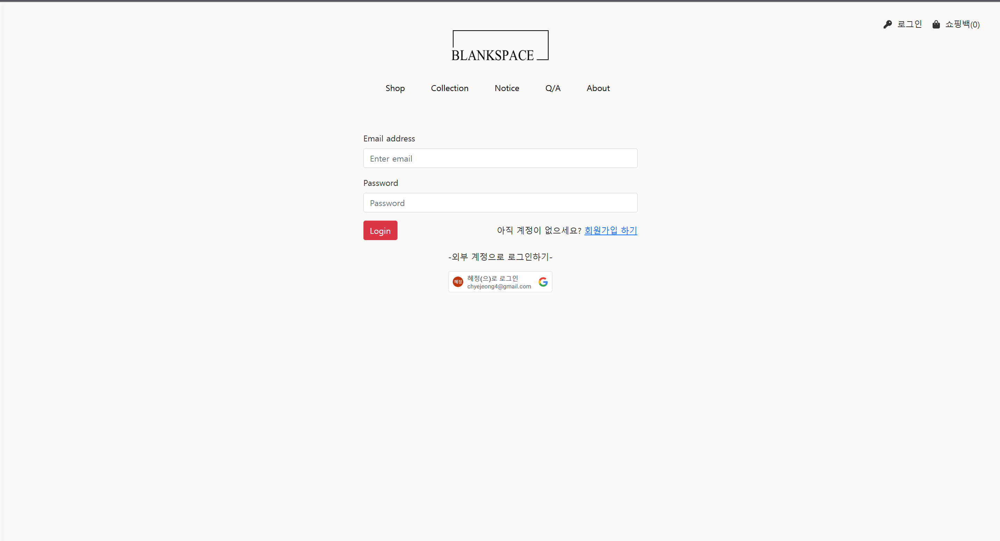  
<그림 6-2> 로그인 페이지

사용자는 이메일과 비밀번호를 입력해 로그인을 진행할 수 있으며, 계정이 없는 경우에는 회원가입 링크를 통해 새 계정을 생성할 수 있습니다. 또한, 구글 등 외부 계정을 이용한 로그인도 지원합니다.

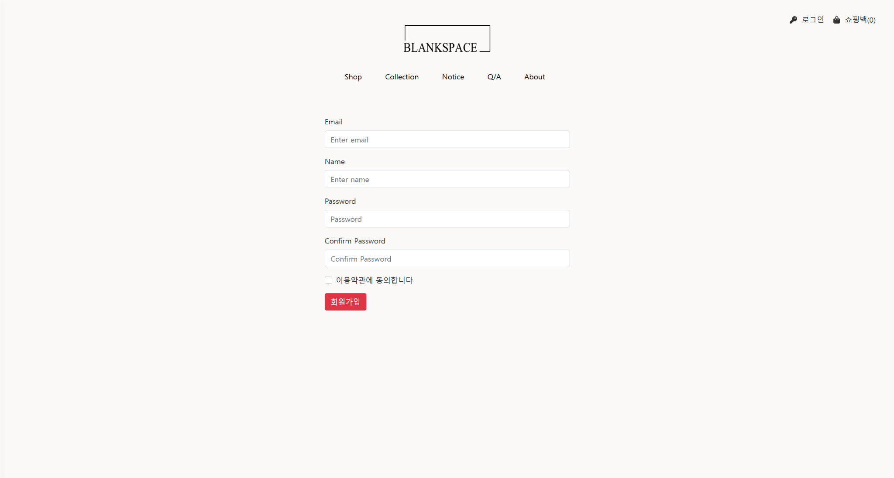  
<그림 6-3> 회원가입 페이지

사용자는 이메일, 이름, 비밀번호를 입력해 계정을 생성할 수 있으며, 입력한 정보는 비밀번호 확인과 이용약관 동의 절차를 통해 검증됩니다.

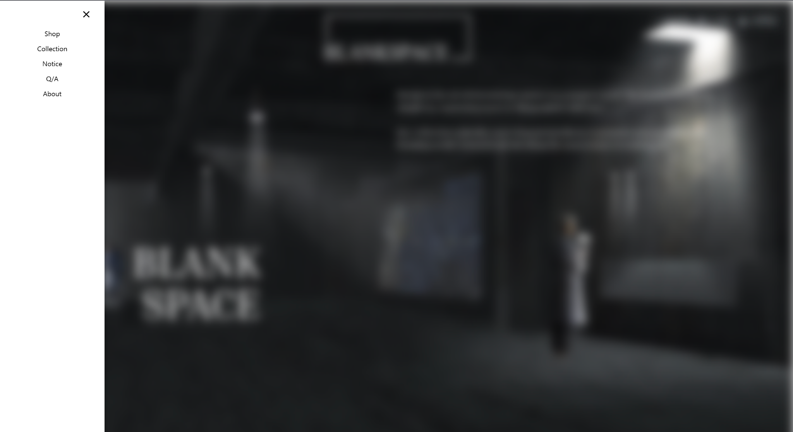  
<그림 6-4> 로그인 후 사이드바 화면

왼쪽에 위치한 사이드바를 통해 쇼핑몰의 주요 섹션으로 이동할 수 있습니다. 사용자는 사이드바를 클릭하여 **Shop, Collection, Notice, QnA, About** 등의 섹션으로 빠르게 접근할 수 있으며, 전체 페이지에서 일관된 위치에 고정되어 있어 편리한 탐색이 가능합니다.

---

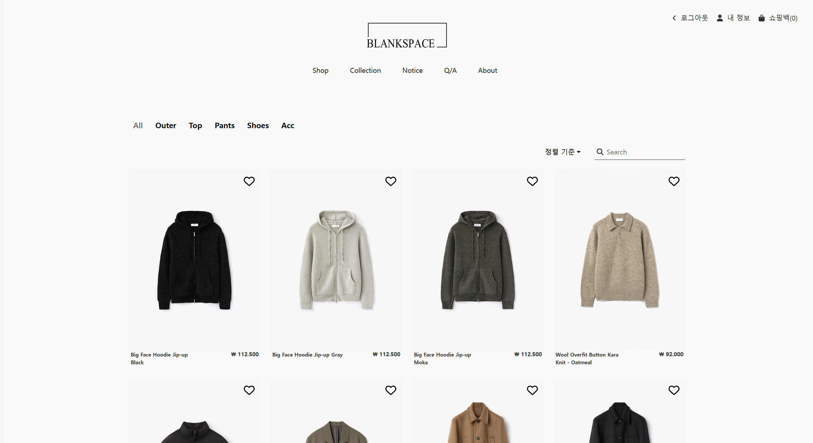  
<그림 6-5> Shop 페이지 (카테고리 및 상품 목록)
사용자는 상단의 카테고리 메뉴(**All, Outer, Top, Pants, Shoes, Acc**)를 선택하여 원하는 상품군을 쉽게 필터링할 수 있습니다. 상품은 카드 형식으로 정렬되어 있으며, 각 카드에는 **상품 이미지, 이름, 색상, 가격** 정보가 함께 표시됩니다. 또한, 상단에는 **검색창**과 함께 **신상품순, 가격 낮은 순, 가격 높은 순, 판매량 순** 등 다양한 정렬 기준이 제공되어 사용자가 원하는 조건에 맞춰 상품을 쉽게 찾을 수 있도록 구성되어 있습니다. 또한 찜하기 기능을 통해 사용자가 관심상품을 관리할 수 있습니다.

---

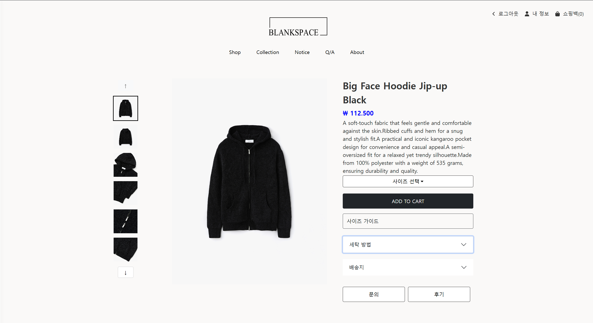  
<그림 6-6> 상품 상세 페이지

사용자가 상품 목록에서 원하는 상품을 클릭하면 해당 페이지로 이동하며, 상품에 대한 **세부 정보(이름, 가격, 색상, 사이즈, 설명 등)**를 확인하고 **구매를 진행**할 수 있도록 구성되어 있습니다.

---
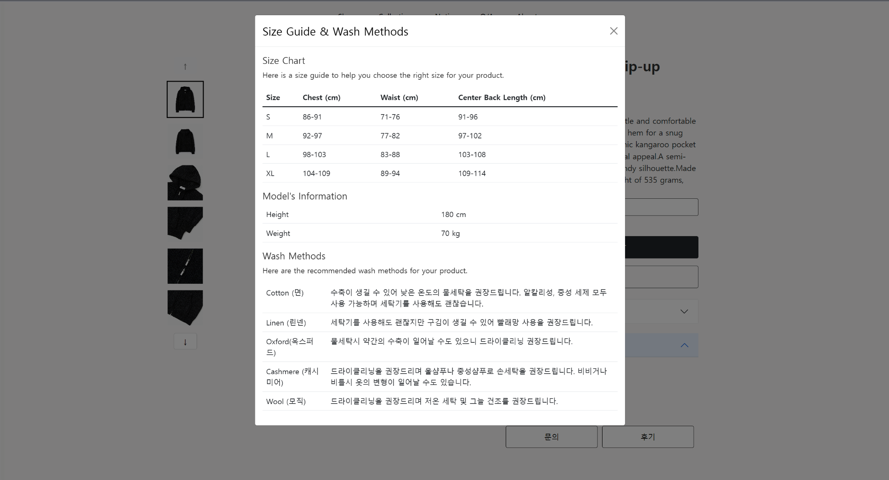  
<그림 6-7> 사이즈 가이드 팝업

사이즈 가이드 버튼을 클릭하면 팝업 창이 나타나 사이즈 차트와 모델 정보를 제공합니다. 사용자는 이를 참고하여 자신의 신체 치수에 적합한 상품을 선택할 수 있으며, 소재별 세탁 방법도 함께 안내되어 있어 옷을 올바르게 관리할 수 있는 정보를 얻을 수 있습니다.

---

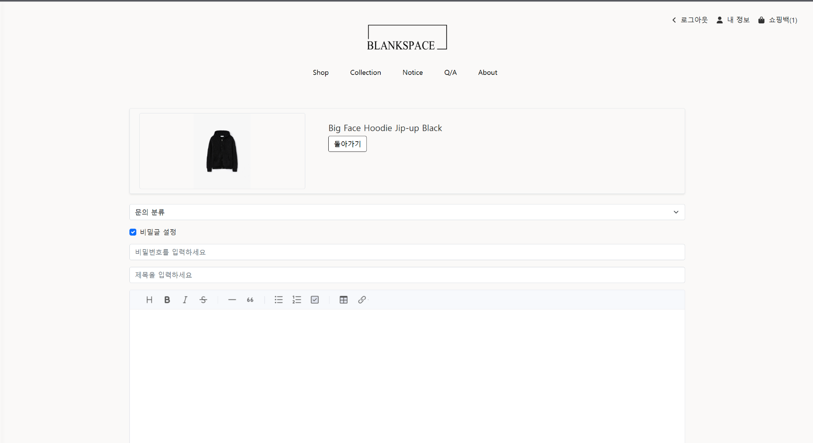  
<그림 6-8> 상품 문의 작성 페이지

문의 버튼을 클릭하면 사용자는 상품에 대한 질문을 작성할 수 있는 페이지로 이동합니다. 이 페이지에서는 **문의 분류 선택**, **비밀글 설정**, **제목과 내용 입력란**이 제공되며, 비밀글로 설정할 경우 비밀번호 입력 필드가 나타납니다. 작성 완료 후에는 이전 페이지로 돌아갈 수 있는 기능도 함께 제공됩니다.

---

  
<그림 6-9> Collection 페이지

Collection 페이지는 Blank Space의 독창적인 스타일과 스토리텔링을 확인할 수 있는 공간입니다. 사진은 그리드 형식으로 배치되어 있으며, 각 컬렉션에 대한 설명이 함께 제공되어 브랜드 아이덴티티를 효과적으로 전달합니다.

---

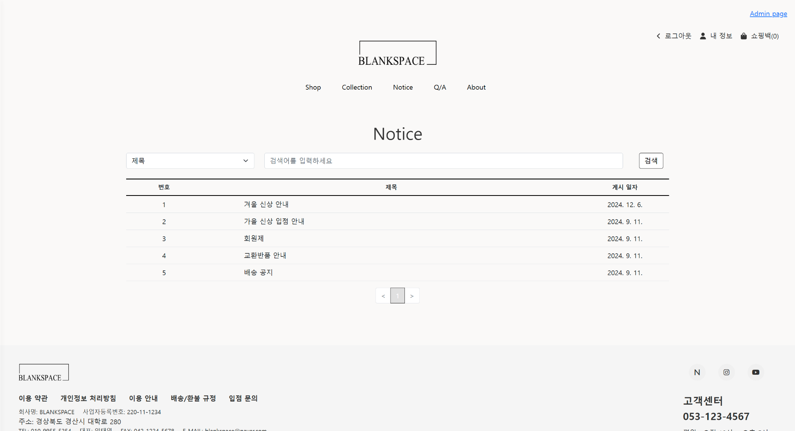  
<그림 6-10> 공지사항 페이지

Notice 페이지는 쇼핑몰의 공지사항을 사용자에게 안내하는 공간입니다.  검색창과 필터 기능을 통해 원하는 공지사항을 쉽게 찾을 수 있으며, 공지 목록은 **번호, 제목, 게시일** 순으로 정리되어 있습니다. 공지 제목을 클릭하면 상세 내용을 확인할 수 있고, 페이지 하단에는 **페이징 기능**, **이용약관**, **고객센터 정보**도 함께 제공됩니다.

---

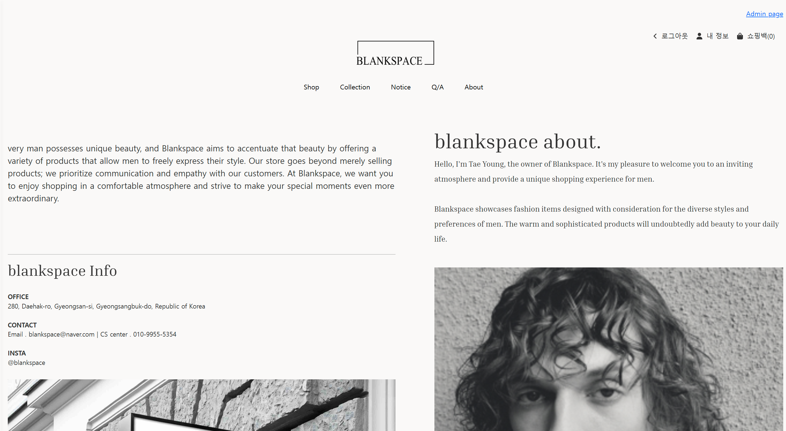  
<그림 6-13> About 페이지

 About 페이지는 Blankspace 브랜드가 추구하는 가치와 스타일을 소개합니다.

### 6-2. Admin
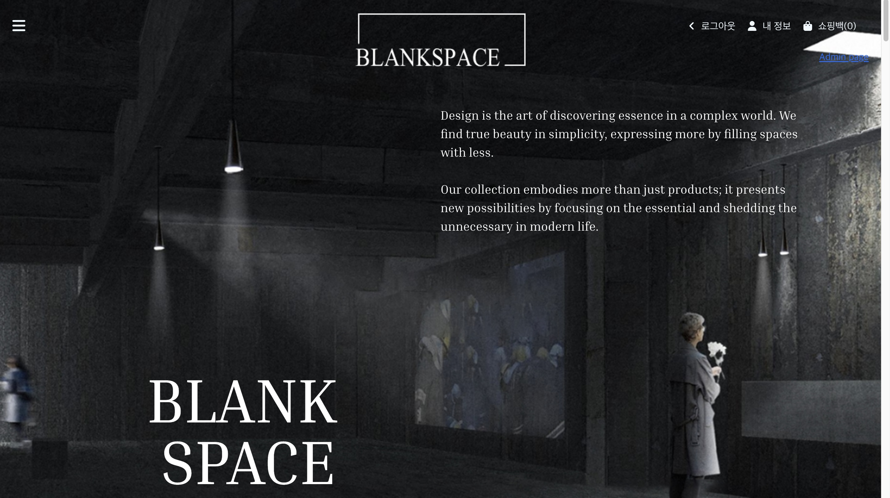  
<그림 6-14> 관리자 로그인 후 화면

랜딩페이지에서 관리자 계정으로 로그인하면, 화면 상단에 "Admin"이라는 버튼이 나타납니다. 해당 버튼을 클릭하면 관리자 전용 페이지로 이동하게 되며, 이곳에서 제품 관리, 사용자 관리 등 BlankSpace와 관련된 다양한 정보를 확인하고 총괄적으로 관리할 수 있습니다. 이를 통해 관리자 계정은 플랫폼의 핵심 데이터를 효율적으로 제어하고, 전체 운영 상태를 체계적으로 파악할 수 있는 권한을 갖게 됩니다.

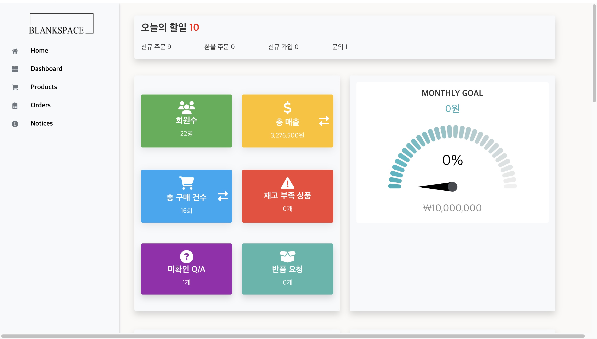  
<그림 6-15> 관리자 대시보드

해당 화면은 AdminPage로 들어갔을 때 가장 먼저 보이는 Dashboard입니다. 해당 페이지에서 총 회원 수, 총 매출, 총 구매 건수, 재고 상품 등 BlankSpace의 상황을 한눈에 파악할 수 있으며, 하단에는 가입자 수와 월별 매출액 추이, 구매된 제품의 배송 상태, Q&A 목록 등 주요 지표가 함께 배치되어 있어 새로 추가된 변경사항을 빠르게 확인하고, 더 자세한 내용은 각 관리 기능 페이지로 이동해 확인할 수 있도록 구성되어 있습니다.

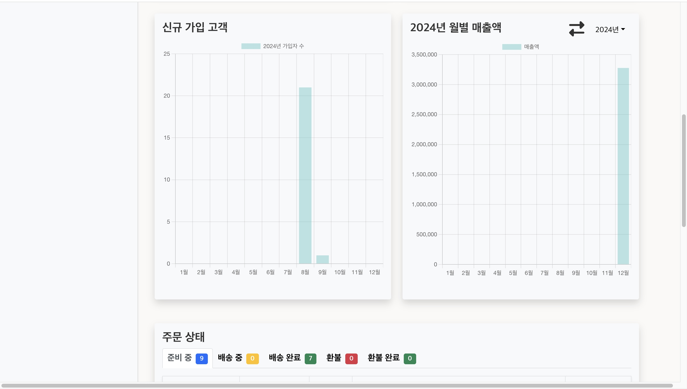 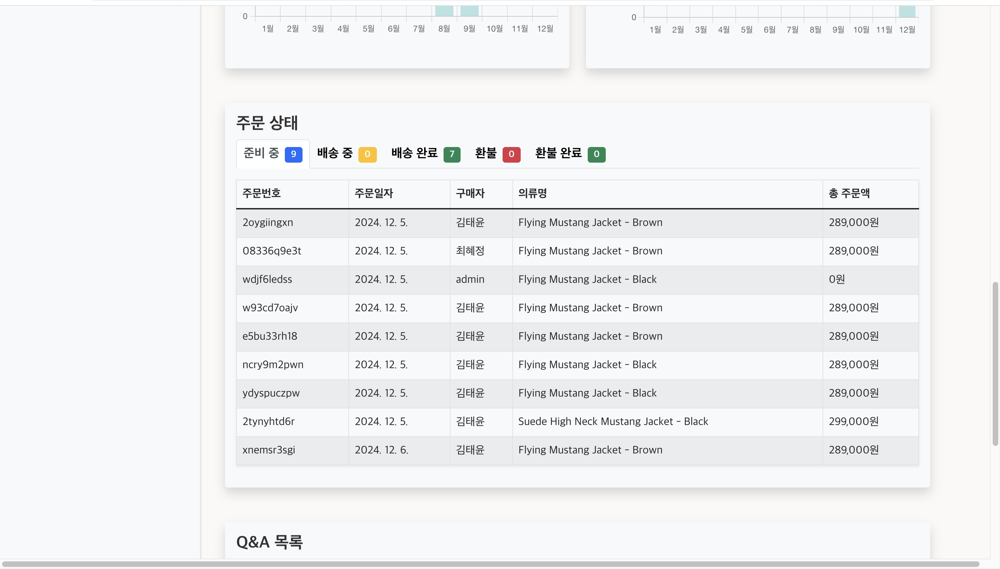  
<그림 6-16> 관리자 페이지

관리자 권한 관리 기능을 통해 추가적인 관리자 권한을 부여할 수 있도록 설계되었습니다. 이를 통해 기존 관리자뿐만 아니라 새로운 관리자 계정을 생성하거나 특정 사용자에게 관리자 권한을 부여하여 플랫폼 운영에 필요한 다양한 역할을 분담할 수 있습니다. 이로 인해 BlankSpace의 관리 업무를 보다 효율적으로 수행할 수 있으며, 운영 과정에서 발생할 수 있는 관리 부담을 분산시키는 데 기여합니다. 결과적으로 여러 관리자가 협업하여 제품, 사용자, 기타 중요한 정보를 체계적으로 관리하고, 플랫폼의 전반적인 품질과 안정성을 유지할 수 있도록 지원합니다.

  
<그림 6-17> 상품 관리 페이지

해당 페이지는 AdminPage의 AdminProductPage로, 이 페이지를 통해 관리자는 새로운 상품을 추가하거나 기존 상품의 세부 정보를 수정할 수 있으며, 필요에 따라 상품을 삭제하는 기능도 제공합니다. 이를 통해 플랫폼 내 상품 데이터의 정확성과 최신성을 유지할 수 있고, 사용자의 요구에 맞춰 빠르고 유연하게 상품 정보를 업데이트할 수 있습니다. 상단에 위치한 상품 검색 기능을 통해 특정 제품명을 검색하여 손쉽게 찾을 수 있으며, 하단에는 제품이 5개씩 나눠 표시되는 페이지네이션 기능이 포함되어 있어 직접 상품을 탐색하는 데에 용이합니다. 또한 관리자는 'Add New Item' 버튼을 클릭하여 제품의 번호, 이름, 설명, 재고, 가격 등의 정보를 입력한 뒤 상품을 등록할 수 있습니다.

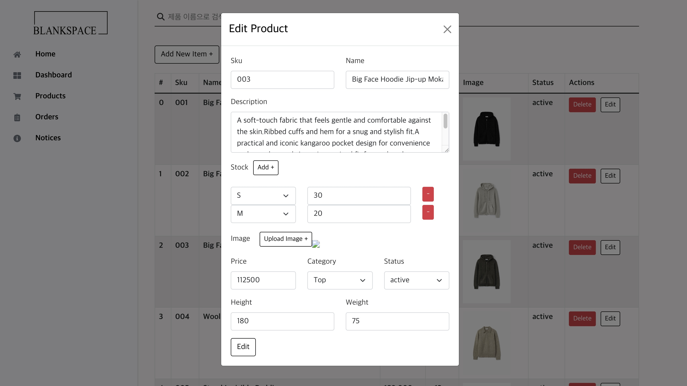  
<그림 6-19> 상품 등록 화면

관리자는 'Add New Item' 버튼을 클릭해 제품의 번호, 이름, 설명, 재고, 가격 등의 정보를 입력하여 새로운 상품을 등록할 수 있습니다. 이 기능을 통해 플랫폼 내 상품 정보를 지속적으로 갱신하고, 사용자 요구에 맞게 빠르게 반영할 수 있도록 지원합니다.

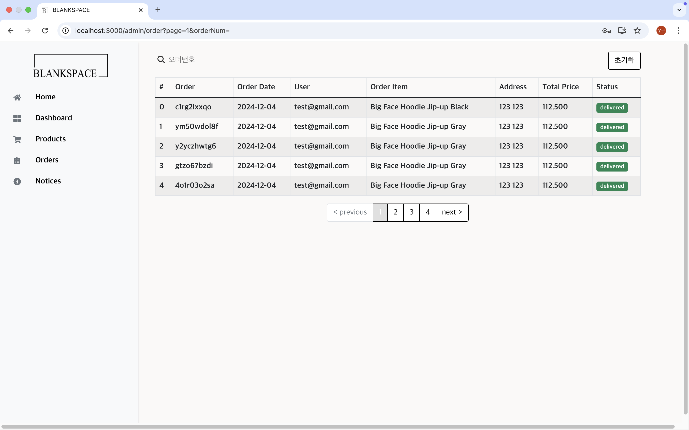  
<그림 6-20> 주문 관리 페이지

관리자는 BlankSpace 플랫폼 내에서 이루어진 모든 주문 목록을 확인할 수 있으며, 각 주문에 대한 세부 정보를 열람하고 실시간으로 상태를 모니터링할 수 있습니다. 이를 통해 주문 처리 현황을 명확히 파악하고, 필요 시 신속하게 대응할 수 있도록 설계되었습니다. 주문 목록은 5개씩 페이지네이션되어 있어 많은 주문이 있을 경우에도 체계적으로 관리할 수 있습니다.

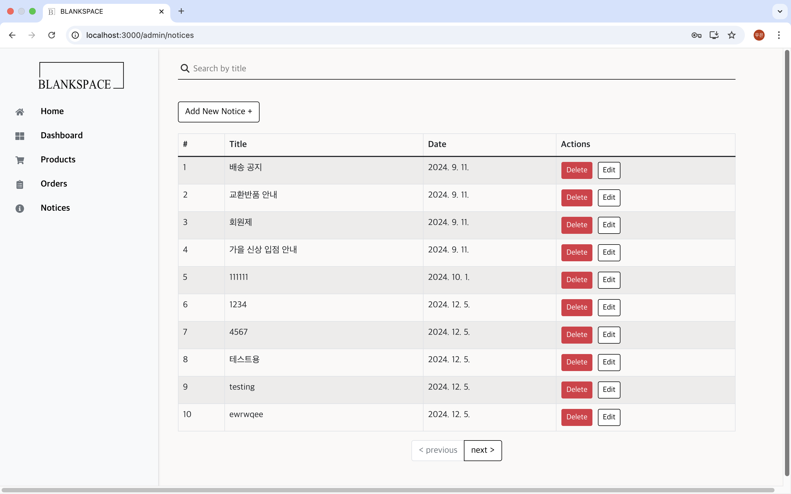  
<그림 6-21> 공지사항 작성 및 수정 화면

해당 페이지는 공지사항을 작성, 수정, 삭제할 수 있는 관리자 전용 페이지입니다. 관리자는 이 화면을 통해 사용자에게 전달할 중요 정보를 체계적으로 등록할 수 있으며, 공지 제목 검색 기능을 통해 특정 공지를 빠르게 찾을 수 있습니다. 또한 제목과 본문을 입력하는 기본적인 텍스트 편집 기능뿐 아니라 이미지 추가 기능도 제공되어, 시각적으로 완성도 높은 공지사항을 작성할 수 있습니다. 작성 또는 수정한 공지사항은 ‘업데이트’ 버튼을 통해 저장되며, 필요 시 언제든지 수정하거나 삭제할 수 있어 플랫폼의 정보가 항상 최신 상태로 유지되도록 관리할 수 있습니다.

