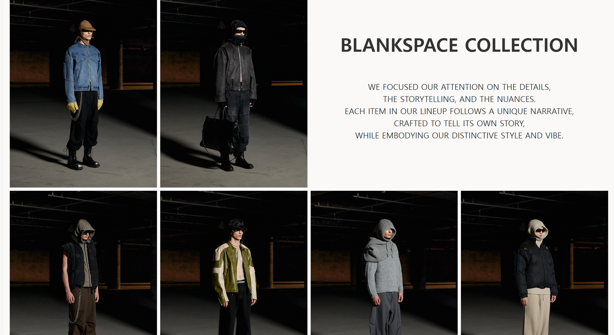
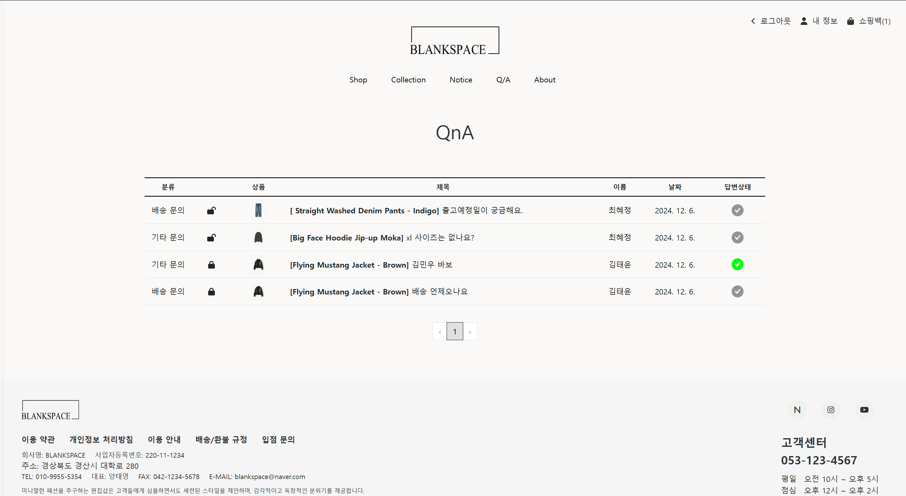

# SE-BlankSpace 
웹 쇼핑몰 프로젝트  
FE : https://github.com/Chyejeong/BlankSpace-Shopping-mall-fe 
BE : https://github.com/Chyejeong/BlankSpace-Shopping-mall-be 

## 1. 프로젝트 소개

이 프로젝트는 3학년 2학기에 수강한 '소프트웨어공학'의 팀프로젝트입니다.
웹 프로그래밍과 소프트웨어 설계 원리를 실제 프로젝트에 적용해보는 것을 목표로 하였으며, 기획부터 개발, 구현까지의 전 과정을 경험하며 팀원들과 협업을 통해 완성도를 높였습니다.

## 2. 프로젝트 개요 및 주요 기능

쇼핑몰의 핵심 기능은 다음과 같습니다:

- **상품 목록 조회 및 검색**
- **상품 상세 페이지**
- **장바구니 담기 / 삭제**
- **회원가입 및 로그인 (JWT 기반 인증)**
- **주문 / 결제 기능**
- **관리자 페이지 (상품 등록, 수정, 삭제)**

---
## 3. 개발 기간

2024년 9월 3일 ~ 2024년 12월 7일

---

## 4. 팀원 소개

| 학번     | 이름   | 이메일                   | 역할     | 전공          |
|----------|--------|--------------------------|----------|---------------|
| 22011600 | 양태영 | xodud120016@gmail.com    | FE, 조장 | 컴퓨터공학과  |
| 21812129 | 김태윤 | elma9810@gmail.com       | BE       | 컴퓨터공학과  |
| 22113637 | 김민우 | kmw233@gmail.com         | FE       | 컴퓨터공학과  |
| 22212041 | 우상은 | kw34763@gmail.com        | FE       | 컴퓨터공학과  |
| 22112339 | 최혜정 | chyejeong4@gmail.com     | BE       | 컴퓨터공학과  |

---

## 5. State Machine Diagram

아래는 웹쇼핑몰 사이트의 클라이언트 상태 다이어그램입니다.  
사이트 내 각 페이지의 전환 관계를 나타낸 것으로, 사용자의 로그인 상태 및 권한에 따라 접근 가능한 페이지가 구분됩니다.

  
<그림 1> Client state machine diagram

- 각 State는 웹 사이트의 페이지 하나를 의미하며, 하나의 State에서 다른 State로 이동하는 것은 페이지 간 전환을 의미합니다.
- 본 다이어그램은 로그인 여부를 기준으로 **총 4개의 Composite State**로 구성되어 있습니다.  
  - `Pages(No Login)` : 비로그인 상태에서 접근 가능한 페이지  
  - `Login` : 로그인 관련 페이지 (로그인, 회원가입 등)  
  - `Pages(Login)` : 로그인 후 일반 사용자가 접근 가능한 페이지  
  - `Pages(Admin)` : 관리자 권한으로만 접근 가능한 페이지  
- 본 다이어그램은 **클라이언트 측의 동작만을 나타낸 것**으로, 실제 서버와의 통신이나 트랜잭션은 포함되지 않았습니다.  
  따라서 본 다이어그램이 제대로 작동하려면 **서버와의 연결**이 반드시 필요합니다.

## 6. User Interface Prototype

### 6-1. User

  
<그림 6-1> 웹 쇼핑몰 첫 화면 (랜딩 페이지)
웹 쇼핑몰의 **첫 화면인 랜딩 페이지**입니다.  

  
<그림 6-2> 로그인 페이지

사용자는 이메일과 비밀번호를 입력해 로그인을 진행할 수 있으며, 계정이 없는 경우에는 회원가입 링크를 통해 새 계정을 생성할 수 있습니다. 또한, 구글 등 외부 계정을 이용한 로그인도 지원합니다.

  
<그림 6-3> 회원가입 페이지

사용자는 이메일, 이름, 비밀번호를 입력해 계정을 생성할 수 있으며, 입력한 정보는 비밀번호 확인과 이용약관 동의 절차를 통해 검증됩니다.

  
<그림 6-4> 로그인 후 사이드바 화면

왼쪽에 위치한 사이드바를 통해 쇼핑몰의 주요 섹션으로 이동할 수 있습니다. 사용자는 사이드바를 클릭하여 **Shop, Collection, Notice, QnA, About** 등의 섹션으로 빠르게 접근할 수 있으며, 전체 페이지에서 일관된 위치에 고정되어 있어 편리한 탐색이 가능합니다.

---

  
<그림 6-5> Shop 페이지 (카테고리 및 상품 목록)
사용자는 상단의 카테고리 메뉴(**All, Outer, Top, Pants, Shoes, Acc**)를 선택하여 원하는 상품군을 쉽게 필터링할 수 있습니다. 상품은 카드 형식으로 정렬되어 있으며, 각 카드에는 **상품 이미지, 이름, 색상, 가격** 정보가 함께 표시됩니다. 또한, 상단에는 **검색창**과 함께 **신상품순, 가격 낮은 순, 가격 높은 순, 판매량 순** 등 다양한 정렬 기준이 제공되어 사용자가 원하는 조건에 맞춰 상품을 쉽게 찾을 수 있도록 구성되어 있습니다. 또한 찜하기 기능을 통해 사용자가 관심상품을 관리할 수 있습니다.

---

  
<그림 6-6> 상품 상세 페이지

사용자가 상품 목록에서 원하는 상품을 클릭하면 해당 페이지로 이동하며, 상품에 대한 **세부 정보(이름, 가격, 색상, 사이즈, 설명 등)**를 확인하고 **구매를 진행**할 수 있도록 구성되어 있습니다.

---
  
<그림 6-7> 사이즈 가이드 팝업

사이즈 가이드 버튼을 클릭하면 팝업 창이 나타나 사이즈 차트와 모델 정보를 제공합니다. 사용자는 이를 참고하여 자신의 신체 치수에 적합한 상품을 선택할 수 있으며, 소재별 세탁 방법도 함께 안내되어 있어 옷을 올바르게 관리할 수 있는 정보를 얻을 수 있습니다.

---

  
<그림 6-8> 상품 문의 작성 페이지

문의 버튼을 클릭하면 사용자는 상품에 대한 질문을 작성할 수 있는 페이지로 이동합니다. 이 페이지에서는 **문의 분류 선택**, **비밀글 설정**, **제목과 내용 입력란**이 제공되며, 비밀글로 설정할 경우 비밀번호 입력 필드가 나타납니다. 작성 완료 후에는 이전 페이지로 돌아갈 수 있는 기능도 함께 제공됩니다.

---

  
<그림 6-9> Collection 페이지

Collection 페이지는 Blank Space의 독창적인 스타일과 스토리텔링을 확인할 수 있는 공간입니다. 사진은 그리드 형식으로 배치되어 있으며, 각 컬렉션에 대한 설명이 함께 제공되어 브랜드 아이덴티티를 효과적으로 전달합니다.

---

  
<그림 6-10> 공지사항 페이지

Notice 페이지는 쇼핑몰의 공지사항을 사용자에게 안내하는 공간입니다.  검색창과 필터 기능을 통해 원하는 공지사항을 쉽게 찾을 수 있으며, 공지 목록은 **번호, 제목, 게시일** 순으로 정리되어 있습니다. 공지 제목을 클릭하면 상세 내용을 확인할 수 있고, 페이지 하단에는 **페이징 기능**, **이용약관**, **고객센터 정보**도 함께 제공됩니다.

---

  
<그림 6-12> QnA 페이지

이 화면은 QnA 페이지로, 사용자가 남긴 문의와 그에 대한 답변 상태를 확인할 수 있는 공간입니다. QnA 목록은 **문의 분류, 상품명, 제목, 작성자, 작성일, 답변 상태**가 표 형태로 정리되어 있으며, 비밀글 여부는 잠금 아이콘으로 표시됩니다.  작성자는 로그인 후 자신의 비밀글을 확인할 수 있으며, 답변 여부는 아이콘으로 표시되어  한눈에 상태를 파악할 수 있도록 구성되어 있습니다.

---

  
<그림 6-13> About 페이지

 About 페이지는 Blankspace 브랜드가 추구하는 가치와 스타일을 소개합니다.

